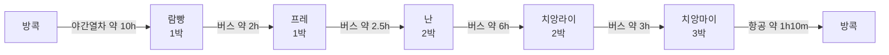
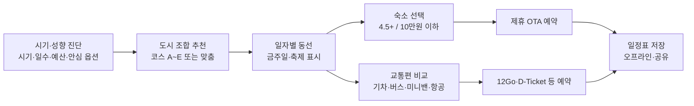

# 혼자 누리는 태국 소도시 힐링 여행 — 서비스 기획안

Sep 23, 2026 · @다루마루

30\~50대 혼자 여행자를 위해 태국 북부·남부 소도시의 일정, 동선, 교통 예약, 검증된 가성비 숙소를 한 번에 짜 주는 여행 플래닝 서비스입니다.

**현재 단계 — 프로토타입:** 외부 서비스 가입이나 제휴·API 연동이 필요한 부분은 빼고, 실사 이미지를 넣은 테스트 데이터와 일반 외부 링크로 먼저 만듭니다. 화면·기술 상세는 [Sabai Solow 웹사이트 설계 문서(프로토타입)](https://claude.ai/artifact/Tpex1dsnpHYTzn2RwTXyUa)에 있습니다. 인력 계획은 현재 보류입니다.

## 1. 서비스 개요와 네이밍

영문명은 Sabai Solow(사바이 솔로우)로 확정했습니다. 로고는 'Solo'는 기본색, 끝 글자 'w'만 포인트 색(사프란 주황)으로 칠해 Solo와 Slow가 함께 읽히게 합니다. Solo(혼자)와 Slow(느리게)를 합쳐 '솔로'라는 말의 거리감을 줄이고, 태국어 'Sabai(สบาย, 편안하다)'와 함께 혼자 느리게 쉬는 여행을 담습니다.

- **서비스명(국문):** 혼자 누리는 태국 소도시 힐링 여행
- **서비스명(영문):** Sabai Solow — Slow Towns of Thailand
- **한 줄 소개:** 도시 추천부터 동선, 교통 예약, 검증된 숙소까지 한 번에 짜 주는 태국 소도시 혼행 플래너

| 후보 | 의미 | 장점 | 약점 |
| --- | --- | --- | --- |
| **Sabai Solow** (확정) | Solo + Slow, 혼자 느리게 | '솔로'의 직접적인 느낌을 누그러뜨리고 슬로우 트래블 톤이 살아남 | Solo의 오타로 보일 수 있음. 로고에서 So·low를 구분하거나 부제로 뜻을 알려야 함, 상표 확인 필요 |
| Sabai Slow | 편안하고 느린 여행 | 가장 읽기 쉽고 오해가 없음 | 혼자 여행 뉘앙스가 사라짐 |
| Sabai Solo | 편안한 혼자 여행 | 짧고 발음 쉬움 | '솔로'가 바로 드러나 거부감이 있을 수 있음 |
| Slow Siam | 느린 태국 | 힐링·슬로우 트래블 톤이 분명 | 혼자 여행 뉘앙스가 약함 |
| Quiet Thai Towns | 조용한 태국 소도시 | 서비스 내용을 그대로 설명 | 길고 브랜드성 약함 |

검토 후 제외한 표기: Sabai So·low(영어 'so low'가 '기분이 가라앉다'로 읽히고, 가운뎅점은 도메인·계정명에 쓸 수 없음), Sabai Sol·ow('ow'가 '아야'로 읽힘), Sabai Sollow('sorrow'와 비슷하고 철자가 헷갈림).

'Lanna(란나)'는 북부 도시에는 잘 맞지만 남부 카오속까지 포괄하지 못해 메인 이름에서는 제외하고, 북부 코스 브랜드(예: Sabai Solow Lanna Route)로 활용하는 것을 권합니다.

## 2. 타깃과 문제 정의

핵심 타깃은 방콕·푸켓은 이미 다녀왔고, 혼자서 조용히 쉬는 여행을 원하는 30\~50대 직장인·프리랜서입니다.

**페르소나 예시**

- **42세 직장인 A:** 연차 7\~10일. 치앙마이는 가봤고, 더 한적한 곳에서 카페·사원·시장을 걷고 싶다. 태국어는 못한다.
- **35세 프리랜서 B:** 2\~3주 한달살기형. 워케이션이 가능한 숙소와 도시 간 야간버스 이동을 선호한다.
- **51세 자영업자 C:** 불편한 호스텔보다 깨끗한 부티크·게스트하우스를 원하고, 안전과 이동 피로도가 중요하다.

| 문제 | 현재 해결 방식 | Sabai Solow의 해결 |
| --- | --- | --- |
| 소도시 정보가 한국어로 거의 없음 | 블로그·카페 검색, 영문 포럼 | 혼행 관점으로 검수한 도시별 한국어 가이드 |
| 도시 간 교통 조합이 복잡함 | 버스회사·철도 사이트를 각각 확인 | 구간별 교통수단 비교 + 예약 페이지 바로 연결 |
| 숙소 품질과 가격을 동시에 맞추기 어려움 | OTA·구글맵을 번갈아 비교 | 평점 4.5+ & 1박 10만원 이하만 자동 필터링 |
| 혼자라 불안함(안전·밤 이동·식사) | 개인 경험에 의존 | 혼행 적합도 점수, 혼밥 가능 식당, 야간 이동 주의 정보 |

## 3. 추천 소도시

출시 지역은 핵심 6개 도시에 추가 추천 14개 도시를 더한 20곳이며, 치앙마이를 북부 허브로, 방콕·촘폰·수랏타니·트랑을 중부·남부 허브로 삼습니다. 외교부 여행경보 지역은 추천에서 모두 제외합니다. 혼행 적합도는 치안, 대중교통 접근성, 혼밥 환경, 현지 투어 참여 쉬움을 5점 만점으로 평가한 내부 기준입니다(초안, 현지 검수 필요).

### 핵심 도시

### 핵심 도시

### 핵심 도시

| 도시 | 한 줄 성격 | 혼행 포인트 | 대표 볼거리·활동 | 추천 체류 | 혼행 적합도 |
| --- | --- | --- | --- | --- | --- |
| 치앙마이 | 북부 허브, 카페·문화 도시 | 한국인·디지털노마드 많고 원데이 투어가 풍부 | 올드시티 사원, 님만헨, 도이수텍, 쿠킹클래스, 선데이마켓 | 3\~5박 | 5 |
| 치앙라이 | 사원과 예술의 도시 | 시내가 작아 도보·그랩으로 충분 | 백색사원(왓롱쿤), 청색사원, 반담 박물관, 싱하파크 | 2\~3박 | 5 |
| 람빵 | 마차와 닭의 도시, 느린 올드타운 | 방콕–치앙마이 철도 중간역이라 들르기 쉬움 | 왓프라탓람팟루얼루앙, 조용한 강변 목조가옥, 마차 투어 | 1\~2박 | 4 |
| 프레 | 티크나무 집과 인디고 천의 마을 | 관광객이 적어 가장 조용함 | 프라이충폰 저택, 챔사이프라탓우른차나 | 1박 | 3 |
| 난 | 북동부 산악의 숨은 보석 | 벽화와 산간 드라이브, 한국인이 거의 없음 | 왓푼민 벽화, 난 야시장, 보클루어 소금마을 | 2\~3박 | 4 |
| 카오속 | 원시림과 호수의 국립공원 | 단체 투어에 합류하면 혼자여도 안전함 | 치어란 호수 보트·수상방갈로, 정글 트레킹 | 2\~3박 | 4 |

### 추가 추천 도시

| 도시 | 지역 | 한 줄 성격 | 혼행 포인트 | 대표 볼거리·활동 | 추천 체류 | 혼행 적합도 |
| --- | --- | --- | --- | --- | --- | --- |
| 빠이 | 북부 | 산속 히피 마을 | 혼행자 비율이 높고 투어로 다니기 쉬움 | 빠이 캐니언 일몰, 온천, 야시장 | 2\~3박 | 5 |
| 매홍손 | 북부 | 안개와 호수의 국경 산읍 | 매우 조용하고 매홍손 루프의 핵심 | 종코호수와 버마식 사원, 반락타이 마을 | 2박 | 4 |
| 매싸롱 | 북부(치앙라이주) | 차밭이 펼쳐진 운남식 산악 마을 | 치앙라이에서 1박 추가하기 좋음, 시원한 고지대 | 다원 티 테이스팅, 운남 국수, 일출 전망대 | 1박 | 3 |
| 수코타이 | 중부 북쪽 | 태국 최초 왕조의 유적 도시 | 유네스코 역사공원을 자전거로 혼자 돌기 좋음 | 수코타이 역사공원, 시사차날라이 | 1\~2박 | 4 |
| 러이 | 동북부 | 안개 낀 고원과 국립공원의 주 | 치앙칸·단사이로 가는 거점, 관광객이 적고 조용함 | 푸끄라둥 국립공원(우기 폐장), 푸르아, 단사이 피타콘 박물관 | 1\~2박 | 3 |
| 치앙칸 | 동북부(러이주) | 메콩강변의 목조 올드타운 | 태국인 감성 여행지, 걷기와 자전거로 충분 | 강변 워킹 스트리트, 푸톡 운해 일출, 탁발 | 1\~2박 | 4 |
| 칸차나부리 | 서부 | 콰이강과 폭포의 도시 | 방콕에서 가까워 첫 소도시로 좋고 통합 투어 많음 | 콰이강의 다리, 에라완 폭포, 죽음의 철도 | 2박 | 4 |
| 후아힌 | 만(걸프) 연안 | 왕실 휴양지의 조용한 해변 도시 | 방콕에서 기차로 쉽게 가고, 치안·편의시설 좋음 | 후아힌 기차역, 시카다 야시장, 카오타끼압 | 2\~3박 | 5 |
| 코싸멧 | 동부 섬 | 방콕에서 가장 가까운 흰 모래 섬 | 작은 섬이라 걸어서 해변을 옮겨 다닐 수 있음 | 아오프라오, 사이깨우 해변, 스노클링 | 2박 | 4 |
| 촘폰 | 남부(걸프) | 코타오로 가는 관문 항구 도시 | 관광객이 적고 야시장·해산물이 저렴 | 야시장, 핫사이리 해변, 코타오행 페리 | 1\~2박 | 3 |
| 코타오 | 남부 걸프 섬 | 다이빙과 스노클링의 작은 섬 | 혼행자가 많고 다이빙 강습으로 자연스럽게 어울림 | 낭유안 섬 전망대, 오픈워터 다이빙 강습, 사이리 비치 | 3박 | 5 |
| 수랏타니 | 남부 허브 | 사무이·코타오·카오속으로 향하는 교통 거점 | 야간열차·항공·버스가 모두 모여 환승이 편함 | 강변 야시장, 차이야 프라보롬마탓 사원 | 1박 | 3 |
| 트랑 | 남부 안다만 | 미식과 섬 호핑의 도시 | 끄라비·푸켓보다 한적하고 야간열차·항공으로 바로 갈 수 있음, 꼬리뻬 환승 거점 | 아침 딤섬 문화, 에메랄드 동굴, 섬 투어 | 2\~3박 | 4 |
| 꼬리뻬 | 남부 안다만 섬(사뚠주) | 투명한 바다의 작은 섬 | 섬이 작아 도보로 다니고 스노클링 투어 합류 쉬움 | 워킹 스트리트, 선라이즈·선셋 비치, 아당·라위 섬 | 3박 | 4 |

**여행경보 지역 제외 원칙:** 외교부 여행경보 2단계 이상과 특별여행주의보 지역은 도시·동선·환승지에서 모두 뺍니다. 지금 기준으로 송클라주 42번 국도 이남·파타니·나라티왓·얄라(3단계), 태국–캄보디아 국경 50km 이내(3단계), 딱주(2단계), 매싸이·치앙센 국경검문소(특별여행주의보)가 해당합니다([외교부 해외안전여행](https://0404.go.kr/ntnSafetyInfo/260/detail)). 그래서 핫야이와 골든트라이앵글(치앙센)은 도시 목록에서 빼고, 꼬리뻬는 트랑을 거쳐 가도록 바꿨습니다. 경보가 바뀌면 해당 도시를 자동으로 숨기고, 이미 짠 일정에는 경고를 띄웁니다.

재방문자를 위한 2단계 후보는 파야오, 나콘파놈, 코랏입니다.

## 4. 핵심 기능

MVP는 ① 맞춤 일정 생성, ② 동선 지도, ③ 검증 숙소, ④ 교통 예약 연결 4가지이며, 모두 '혼자' 기준으로 설계합니다.

| 기능 | 설명 | 우선순위 |
| --- | --- | --- |
| 여행 시기 설정 | 날짜 지정 / 월만 지정 / 미정 선택. 미정이면 성수기·우기·폭염·연무 가이드로 월 추천(6장) | MVP |
| 여행 성향 진단 | 일수, 예산, 이동 강도(여유/보통/부지런), 관심사(사원·카페·자연·요가·워케이션) | MVP |
| 안심 일정 옵션 | 켜면 도착 시간·야간 이동·숙소 기준을 보수적으로 적용. 여성 혼행자에게 추천(8장) | MVP |
| AI 일정 생성 | 진단 결과로 도시 조합·순서·체류일을 제안, 드래그로 수정 | MVP |
| 동선 지도 | 하루 단위 스팟을 거리순으로 묶고 이동 시간 표시, 구글맵 길찾기로 열기 | MVP |
| 금주일·축제 알림 | 일정에 걸린 불교 기념일·선거일(주류 판매 금지), 축제, 공휴일을 날짜 카드에 표시(7장) | MVP |
| 숙소 큐레이션 | 구글맵 평점 4.5+ & 1박 10만원 이하만 노출, 혼행 태그 | MVP |
| 교통 예약 연결 | 구간별 기차·고속버스·야간버스·미니밴·항공 비교 후 예약 페이지로 딥링크 | MVP |
| 혼행 안심 팩 | 야간 도착 주의 구간, 대사관·관광경찰(1155) 연락처, 혼밥 가능 식당 | MVP |
| 오프라인 일정표 | 바우처·일정·태국어 목적지 카드를 PDF로 저장 | MVP |
| 카카오톡 연계 | 일정표 공유, 출발 전·금주일·축제 알림 메시지 | 2단계 |
| 현지 투어 연결 | 도시별 대표 투어 카드(설명·준비물·주의점·추천 포인트)와 제휴 링크(11장) | MVP |
| 혼행자 라운지 | 같은 도시·같은 날짜 혼행자의 후기·동행 모집(선택) | 3단계 |

## 5. 대표 동선과 교통편

서비스는 하루 이동을 최대 6시간, 야간 이동은 열차 침대칸·VIP 버스로 한정하는 '혼행 피로도 규칙'으로 동선을 짭니다. 아래 소요 시간은 일반적인 어림값이며 출시 전 운행사 시간표로 검증해야 합니다.

### 추천 코스

| 코스 | 일수 | 동선 | 주요 교통 |
| --- | --- | --- | --- |
| A. 북부 슬로우 루프 | 10일 | 방콕 → 람빵(1) → 프레(1) → 난(2) → 치앙라이(2, 매싸롱 1박 선택) → 치앙마이(3) → 방콕 | 야간열차, 고속버스, 국내선 |
| B. 매홍손 산악 루프 | 7일 | 치앙마이(2) → 빠이(2) → 매홍손(2) → 치앙마이(1) | 미니밴, 국내선(매홍손→치앙마이) |
| C. 남부 정글 & 미식 | 7일 | 방콕 → 수랏타니 → 카오속(3) → 트랑(3) → 방콕 | 야간열차, 미니밴 |
| D. 역사와 강변 | 7일 | 방콕 → 칸차나부리(2) → 방콕 → 수코타이(2) → 치앙마이(2) | 기차, 미니밴, 고속버스 |
| E. 메콩강 감성 | 6일 | 방콕 → 러이(1) → 치앙칸(2) → 러이 → 방콕 | 야간버스·항공, 송태우 |
| F. 걸프 해안과 코타오 | 10일 | 방콕 → 후아힌(2) → 촘폰(1) → 코타오(3) → 수랏타니(1) → 카오속(2) → 방콕 | 기차, 고속페리, 미니밴, 야간열차·항공 |
| G. 안다만 남쪽 섬 | 7일 | 방콕 → 트랑(2) → 꼬리뻬(3) → 트랑(1) → 방콕 | 항공·야간열차, 미니밴 + 스피드보트(11\~5월만) |
| H. 방콕 근교 쉼표 | 4일 | 방콕 → 코싸멧(2) → 방콕, 또는 방콕 → 후아힌(3) | 버스·미니밴 + 페리, 기차 |

### A코스 예시

난→치앙라이가 가장 긴 구간이어서, 이동 당일은 오후 일정을 비워두도록 자동 배치합니다.

### 구간별 교통편 (어림)

| 구간 | 기차 | 고속·야간버스 | 미니밴·배 | 항공 |
| --- | --- | --- | --- | --- |
| 방콕 ↔ 치앙마이 | 침대칸 11\~13h | VIP 9\~10h | — | 1h10m |
| 방콕 ↔ 람빵 | 9\~10h | 8\~9h | — | 1h |
| 치앙마이 ↔ 람빵 | 2\~3h | 1.5\~2h | — | — |
| 람빵 ↔ 프레 | 덴차이역 경유 | 2h | — | — |
| 프레 ↔ 난 | — | 2\~2.5h | — | — |
| 난 ↔ 치앙라이 | — | 5\~6h | — | — |
| 치앙마이 ↔ 치앙라이 | — | 3\~3.5h | — | — |
| 치앙라이 ↔ 매싸롱 | — | 매짠까지 버스 + 송태우 1.5\~2h | — | — |
| 치앙마이 ↔ 빠이 | — | — | 3h | — |
| 빠이 ↔ 매홍손 | — | — | 2.5\~3h | — |
| 치앙마이 ↔ 수코타이 | — | 5\~6h | — | — |
| 방콕 ↔ 수코타이 | — | 6\~7h | — | 1h10m |
| 방콕 ↔ 칸차나부리 | 3h(톤부리역) | 2.5\~3h | 2\~2.5h | — |
| 방콕 ↔ 러이 | — | 9\~10h | — | 1h(러이 공항) |
| 러이 ↔ 치앙칸 | — | 버스·송태우 1\~1.5h | — | — |
| 방콕 ↔ 후아힌 | 3.5\~4.5h | 3\~4h | 3h | — |
| 방콕 ↔ 코싸멧 | — | 반페까지 3\~3.5h | 미니밴 3h + 페리 30\~40분 | — |
| 후아힌 ↔ 촘폰 | 4\~5h | 4h | 4h | — |
| 방콕 ↔ 촘폰 | 침대칸 7\~9h | 7\~8h | — | 1h |
| 촘폰 ↔ 코타오 | — | — | 고속페리 1.5\~2h | — |
| 코타오 ↔ 수랏타니 | — | — | 페리 + 버스 연계 5\~7h | — |
| 촘폰 ↔ 수랏타니 | 2\~3h | 3h | 3h | — |
| 방콕 ↔ 수랏타니 | 침대칸 9\~11h | 10\~11h | — | 1h10m |
| 수랏타니 ↔ 카오속 | — | 2\~2.5h | 2h | — |
| 방콕 ↔ 트랑 | 침대칸 15\~16h | 12\~13h | — | 1h30m |
| 트랑 ↔ 꼬리뻬 | — | — | 빡바라 항까지 미니밴 1.5\~2h + 스피드보트 1.5h, 또는 섬 경유 스피드보트 3\~5h(건기) | — |

도시 내 이동은 그랩·볼트 앱과 송태우를 안내하고, 스쿠터 렌탈은 국제운전면허(이륜 포함) 보유자에게만 제안합니다.

## 6. 여행 시기 설정과 계절 가이드

진단 첫 문항에서 여행 시기를 **날짜 지정 / 월만 지정 / 미정** 중에서 고릅니다. '미정'이면 아래 계절표를 월별 카드로 보여 주고, 고른 월에 맞는 도시와 코스를 추천합니다. 날짜를 정한 경우에도 같은 계절 배지가 일정표 상단에 붙습니다.

| 기간 | 배지 | 날씨 | 가격 | 장점 | 위험·주의 |
| --- | --- | --- | --- | --- | --- |
| 11월\~2월 | 추천 · 성수기 | 건기, 북부 아침 10\~15°C, 낮 25\~30°C | 숙소·교통 가격 상승, 축제 기간은 평소의 2\~3배 | 걷기 좋고 하늘이 맑음, 축제 많음 | 로이끄라통·연말에는 숙소·야간버스가 일찍 매진, 산간 지역·러이 고원 새벽 한기 |
| 2월 말\~4월 (북부) | 주의 · 연무기 | 건기, 기온 상승 | 보통 | 관광객 감소 | 화전 연기로 미세먼지(PM2.5) 심함. 치앙마이·치앙라이·매싸롱·매홍손·난은 호흡기 질환자에게 비추천 |
| 3월\~5월 | 주의 · 폭염기 | 낮 35\~40°C 이상 | 보통(송크란 주간만 상승) | 4월 송크란 물축제 | 열사병, 낮 야외 일정 피로. 일정을 오전·야간으로 자동 재배치. 이 시기에는 후아힌·코싸멧·코타오 등 해안을 우선 추천 |
| 6월\~10월 | 알뜰 · 우기 | 오후 소나기, 8\~9월에 비가 가장 많음 | 숙소 20\~40% 저렴(어림) | 초록 풍경, 한적함. 걸프 섬(코타오)은 이 시기가 오히려 맑음 | 산사태·도로 침수(치앙마이–빠이 762굽이, 난 산악도로), 하천 범람(치앙라이·치앙마이), 트레킹·동굴 투어 취소, 러이 푸끄라둥 국립공원 폐장 |
| 5월\~10월 (남부 안다만) | 알뜰 · 남부 우기 | 카오속·트랑·꼬리뻬 폭우와 높은 파도 | 저렴 | 카오속 정글이 가장 풍성함 | 꼬리뻬행 스피드보트 대폭 감편, 섬 숙소 다수 휴업. 트랑 섬 투어 제한, 카오속 계곡 트레킹 급류 위험 |
| 10월\~12월 (남부 걸프 연안) | 알뜰 · 걸프 우기 | 촘폰·수랏타니·코타오는 11월에 비가 가장 많음 | 보통 | 같은 시기 안다만(꼬리뻬·트랑)은 건기 시작 | 홍수, 코타오행 페리 결항·다이빙 시야 저하. 이 시기 남부는 안다만 쪽으로 자동 전환 추천 |

**미정일 때 추천 문구(예시)**

- "최적기는 **11월\~2월**입니다. 다만 숙소·교통 가격이 오르고, 로이끄라통·연말은 매진이 빠릅니다."
- "**6월\~10월**은 우기라 가격이 저렴하지만, 산간 도로 산사태와 홍수로 이동이 끊길 수 있어 예비일 1일을 넣어 드립니다."
- "**3월\~5월**은 폭염기이고, 북부는 **2월 말\~4월**에 미세먼지가 심합니다. 이 시기에는 후아힌·코싸멧·코타오 등 해안 지역을 먼저 추천합니다."

기온·강수·가격은 일반적인 경향을 정리한 어림값입니다. 서비스에서는 태국 기상청 예보, 대기질 지수, 숙소 실시간 가격으로 배지를 갱신합니다.

## 7. 공휴일·금주일·축제 알림

일정 기간에 금주일이나 축제가 걸리면 해당 날짜 카드에 배지와 한 줄 안내를 자동으로 붙입니다. 태국은 불교 기념일 5일과 선거일에 주류 판매를 금지하며, 날짜는 음력에 따라 매년 바뀝니다.

**알림 종류**

- **금주일:** "오늘은 불교 기념일이라 편의점·식당·바에서 술을 팔지 않습니다. 허가받은 호텔·유흥업소는 예외일 수 있습니다." 선거일은 전날 18시\~당일 18시입니다.
- **축제:** 볼거리 추천과 함께 "숙소 가격 상승·조기 매진, 교통 혼잡" 경고를 표시하고 예약 시점을 앉당기도록 안내합니다.
- **공휴일·연휴:** 관공서·일부 박물관 휴무, 기차·버스 매진 가능성을 표시합니다.

**참고: 주류 판매 시간** — 2026년 5월 29일부터 매일 11:00\~24:00로 바뀌어 오후 2\~5시 판매 금지가 없어졌습니다([Time Out Bangkok](https://www.timeout.com/bangkok/news/alcohol-rules-052926)).

### 2026년 금주일

| 날짜 | 명칭 | 비고 |
| --- | --- | --- |
| 10월 26일(월) | 오크파나(안거 종료) | 난 전통 보트 레이스가 이 무렵 열림 |
| 7월 29\~30일 | 아산하부차 + 카오파나(안거 시작) | 이틀 연속 48시간 |
| 5월 31일(일) | 위사카부차 |  |
| 3월 3일(화) | 마카부차 |  |

2027년 날짜는 태국 정부가 공휴일을 발표하면 반영합니다([출처](https://thairanked.com/en/blogs/no-alcohol-days-thailand-2026/)).

### 도시별 주요 축제

| 시기 | 축제 | 도시 | 여행 영향 |
| --- | --- | --- | --- |
| 1월 중순 | 보생 우산 축제 | 치앙마이 근교 | 낮 축제, 영향 적음 |
| 2월 첫 주말 | 치앙마이 꽃 축제 | 치앙마이 | 구시가지 퍼레이드, 교통 통제 |
| 2월 중순 | 수중 결혼식 | 트랑 | 섬 투어 수요 증가 |
| 3월 말\~4월 초 | 포이상롱(동자승 수계식) | 매홍손 | 도시 최대 행사, 숙소 부족 |
| 4월 13\~15일 | 송크란(태국 새해) | 전국(치앙마이 최대) | 교통 매진, 가격 급등, 물세례 대비 방수팩 |
| 6\~7월 | 피타콘 가면 축제 | 러이 단사이(치앙칸 연계) | 초어 숙소 부족 |
| 9\~10월 | 난 전통 보트 레이스 | 난 | 연중 가장 붐빔, 예약 필수 |
| 10월(음력 9월 초) | 채식 축제 | 트랑 | 식당 다수가 채식 메뉴만 판매 |
| 11월 23\~25일 (2026) | 로이끄라통 · 이펭 | 치앙마이, 수코타이 | 구시가지 숙소 2\~3배, 4\~6개월 전 예약 권장([출처](https://www.beautiful-chiangmai.com/festivals/yi-peng-loy-krathong/)) |
| 11월 말\~12월 초 | 콰이강의 다리 주간 | 깐짜나부리 | 불꽃놀이·조명쇼, 주말 혼잡 |
| 12월\~2월 | 치앙라이 꽃 축제 | 치앙라이 | 시내 공원 행사, 영향 적음 |

날짜가 정해지지 않은 축제는 매년 태국관광청(TAT) 발표 날짜로 갱신합니다.

## 8. 여성 혼자 여행 안심 옵션

서비스는 성별과 상관없이 쓸 수 있고, 진단 단계에서 **'안심 일정'** 스위치를 켜면 아래 규칙이 일정·숙소·교통에 함께 적용됩니다. 성별은 묻지 않으며, 누구나 켤 수 있는 옵션입니다.

| 영역 | 안심 일정 규칙 |
| --- | --- |
| 도착 시간 | 도시 도착은 21시 이전으로 배치하고, 새벽 도착 야간버스는 제외 |
| 야간 이동 | 야간버스 대신 열차 침대칸을 우선 추천. 특급 9/10호(방콕–치앙마이)와 31/32호(방콕–수랏타니 구간)는 여성·유아 전용 침대칸이 있음([출처](https://www.thaitrainguide.com/trains/cnr-sleeper/)) |
| 도시 내 이동 | 밤에는 그랩·볼트 등 기록이 남는 호출 앱을 우선, 스쿠터 렌탈은 추천하지 않음 |
| 숙소 | 24시간 또는 야간 리셉션, 여성 전용 층·도미토리, 객실 잠금장치, 번화가 도보 10분 이내. 리뷰에 'solo female', 'safe' 언급이 많은 곳에 배지 |
| 투어·활동 | 평점 높은 소규모 그룹 투어 우선, 인적 드문 트레킹·폭포는 단독 방문 대신 투어 추천 |
| 일정 밀도 | 야간 일정은 야시장·구시가지 등 사람 많은 곳으로 한정 |
| 비상 대비 | 관광경찰 1155, 주태국 한국대사관 연락처, 숙소 주소 태국어 카드, 가족에게 일정표 공유 링크 |

안심 일정을 켜면 도시별 혼행 적합도 점수에 '야간 치안' 항목이 가중되고, 최대 이동시간이 6시간에서 5시간으로 줄어듭니다.

## 9. 숙소 큐레이션

숙소는 구글맵 평점 4.5 이상, 세금 포함 1박 10만원 이하(약 2,300\~2,500바트, 1바트≈40\~43원 가정)를 모두 만족하는 곳만 노출합니다. 평점과 가격은 자주 바뀌므로 고정 리스트가 아니라 조회 시점의 실시간 데이터로 필터링합니다.

### 필터 기준

| 기준 | 값 | 데이터 출처 |
| --- | --- | --- |
| 구글맵 평점 | 4.5 이상 | Google Places API (rating) |
| 리뷰 수 | 100개 이상 (소도시는 50개 이상) | Google Places API (userRatingCount) |
| 1박 가격 | 세금·봉사료 포함 10만원 이하, 1인 1실 기준 | 구글맵 숙소 정보의 1박 최저가와 최저가 사이트. \[구글맵에서 최저가 보기\]로 최저가 사이트에 연결(프로토타입은 운영자 확인값) |
| 위치 | 구시가지·야시장 도보 15분, 또는 터미널·역 차량 10분 이내 | Google Routes API |
| 혼행 적합 | 1인 요금, 늦은 체크인 가능, 리뷰 내 solo 언급 | OTA 정보 + 리뷰 키워드 분석 |
| 제외 | 도미토리 전용 호스텔, 최근 6개월 평점 급락 | 내부 규칙 |

### 도시별 노출 방식

- 도시마다 **3개 가격대**로 묶어 보여 줍니다: 3만원 이하(게스트하우스), 3\~6만원(부티크), 6\~10만원(리조트형).
- 각 카드에 평점·리뷰 수·1박 최저가·터미널까지 거리·혼행 태그를 표시하고, 예약은 제휴 OTA로 연결합니다.
- 카오속·매홍손처럼 숙소 수가 적은 지역은 리뷰 수 기준을 30개까지 낮추고 '리뷰 적음' 배지를 붙입니다.

구글 약관상 평점 등 장소 정보는 장기 저장할 수 없어 place\_id만 저장하고 표시할 때 조회하며, 'Google' 출처 표기가 필요합니다. 실제 도시별 추천 숙소 리스트는 출시 전 데이터 수집 단계에서 확정합니다.

## 10. 교통 예약 연결

예약은 직접 판매하지 않고, 구간·날짜가 미리 채워진 딥링크로 제휴 플랫폼 또는 공식 사이트로 보내는 방식으로 시작합니다. 제휴 플랫폼은 수수료 수익을, 공식 사이트는 최저가와 신뢰를 담당합니다.

| 연결처 | 구분 | 커버 교통 | 연동 방식 | 메모 |
| --- | --- | --- | --- | --- |
| [12Go](https://agent.12go.asia/) | 제휴(1순위) | 기차, 버스, 야간버스, 미니밴, 페리, 항공 | 딥링크, 검색폼, 화이트라벨, API(협의) | 이익의 50% 수수료, 30일 쿠키 |
| [Bookaway](https://www.bookaway.com/affiliates) | 제휴(2순위) | 버스, 기차, 미니밴, 페리, 픽업 | 제휴 링크 | 매출의 5%, 30일 쿠키 |
| [BusX (busandvan.com)](https://www.busandvan.com/en-us/timetable) | 제휴 후보 | 고속·야간버스, 미니밴 150여 개 운수사 | 링크(제휴 협의) | BKS·나콘챠이어 등 시간표 |
| [BusOnlineTicket](https://www.busonlineticket.co.th/bus-tickets/) | 제휴 후보 | 고속·야간버스 | 링크 | 그린버스·솜밧투어·999 취급 |
| [태국철도 D-Ticket](https://www.thailand.go.th/issue-focus-detail/001_01_113) | 공식 | 기차(침대칸 포함) | 외부 링크 + 예약 가이드 | 외국인은 여권으로 가입, 보통 30일 전 오픈 |
| [나콘챠이어](https://www.nakhonchaiair.com/ncaweb/en/route) | 공식 | 방콕–북부 VIP·야간버스 | 외부 링크 | 혼행자용 1인석 좌석 안내 |
| 국내선(녹에어·타이에어아시아·방콕에어웨이즈) | 제휴(항공 메타검색) | 난·프레·람빵·매홍손·러이·트랑 공항 | 항공 검색 딥링크 | 버스 6시간+ 구간의 대안 |

**연동 규칙**

1. 동선의 각 이동 구간에 '교통편 보기' 버튼을 두고, 수단별 소요 시간·가격대·혼행 팁을 비교합니다.
2. 선택 시 출발지·도착지·날짜·인원(1명)이 채워진 딥링크를 새 창으로 엽니다.
3. 야간버스는 VIP 24석·여성 전용석 여부, 기차는 상단/하단 침대 차이를 미리 안내합니다.
4. 예약 완료 후 티켓 번호를 사용자가 직접 붙여넣으면 일정표에 저장됩니다(API 연동 전 단계).

## 11. 현지 투어 연결

동선의 각 날짜에 대표 투어를 카드로 보여 주고, 카드를 누르면 **어떤 서비스인가 · 준비할 것 · 주의할 점 · 추천 포인트**를 펼친 뒤 투어 사이트로 연결합니다. 프로토타입의 대표 투어는 **코끼리 목욕 · 쿠킹클래스 · 짚라인 · 트레킹** 4종이며, 코끼리 탑승 프로그램은 다루지 않습니다.

### 연결 플랫폼

| 연결처 | 프로토타입 | 다음 단계 |
| --- | --- | --- |
| 투어 플랫폼(Klook, KKday, GetYourGuide, Viator) | 도시·투어 검색 결과로 가는 일반 링크 | 제휴 링크(수수료) |
| 업체 공식 사이트 | 대표 업체가 있으면 일반 링크 | 제휴 협의 |

다음 단계 제휴 조건(공개 기준): Klook 투어 6.5% 안팎, KKday 최대 8%, GetYourGuide·Viator 8%, 모두 30일 쿠키([Klook](https://getlasso.co/affiliate/klook/), [KKday](https://involve.asia/blog/kkday-affiliate-program/), [GetYourGuide](https://partner.getyourguide.support/hc/en-us/articles/13981068165917-Our-partner-program), [Viator](https://track360.io/blog/viator-getyourguide-affiliate-programs-operator-teardown-2026)).

### 투어 선정 기준

- 플랫폼 평점 4.5 이상, 리뷰 100개 이상
- 1인 예약 가능, 가능하면 무료 취소(24시간 전)
- 동물 윤리: 코끼리 타기·동물 쇼가 있는 상품은 제외
- 여행경보 지역(골든트라이앵글 국경 등)을 들르는 상품은 제외
- 안심 일정을 켜면 소규모 그룹·숙소 픽업 포함 상품을 먼저 보여 줌

### 도시별 대표 투어 카드

| 투어 | 가능한 도시 | 어떤 서비스인가 | 준비할 것 | 주의할 점 | 추천 포인트 |
| --- | --- | --- | --- | --- | --- |
| 코끼리 목욕 | 치앙마이, 카오속 | 코끼리 탑승이 없는 보호소에서 먹이를 주고 강·진흙 목욕을 함께하는 반나절·하루 프로그램 | 젖어도 되는 옷·수영복, 갈아입을 옷, 수건, 아쿠아슈즈, 방수팩, 선크림·벌레 기피제 | 코끼리 탑승·쇼가 있는 곳은 소개하지 않음. 코끼리가 원할 때만 목욕하는 방식인지 확인, 코끼리 뒤·바로 옆에 서지 않기, 보통 전날까지 예약 | 가까이서 코끼리와 교감, 숙소 픽업 포함이 많고 혼자 온 참가자도 많음 |
| 쿠킹클래스 | 치앙마이, 빠이, 치앙라이 | 시장에서 재료를 고르고 태국 요리 4\~5가지를 직접 만드는 반나절·하루 수업 | 편한 옷, 알레르기·채식 여부 미리 알림 | 매운 정도 조절 요청, 오전·오후·저녁 반 중 선택 | 1인 1조리대, 레시피북 제공, 만든 요리를 함께 먹어 혼밥 부담이 없음 |
| 짚라인 | 치앙마이 | 정글 나무 사이를 와이어로 이동하는 2\~4시간 코스(구간 수·길이는 업체마다 다름) | 운동화, 긴바지, 벌레 기피제, 소지품 최소화 | 키·체중 제한과 보험 포함 여부 확인, 안전 장비 설명 듣기, 우기엔 미끄러움 | 짧은 시간에 정글 풍경을 즐기는 액티비티, 혼자 가도 그룹으로 진행 |
| 트레킹 | 치앙마이, 치앙라이, 빠이, 매홍손, 카오속 | 가이드와 함께 숲길·폭포·산간 마을을 걷는 반나절\~1박 2일 코스 | 트레킹화, 우비, 물, 벌레·거머리 기피제, 긴 옷 | 우기엔 길이 미끄럽고 거머리가 많음, 난이도·거리 확인, 국립공원은 가이드 동행, 마을 주민 사진은 허락받기 | 대중교통으로 못 가는 자연을 안전하게, 1박 코스는 현지 마을 숙박 체험 |

투어 내용과 가격은 업체마다 다르므로 표의 준비물·주의점은 일반적인 안내이며, 프로토타입 카드는 실사 이미지를 넣은 테스트 데이터로 만듭니다. 다른 투어(다이빙, 섬 투어 등)는 다음 단계에 추가합니다.

## 12. 사용자 흐름

사용자는 5문항 진단부터 일정표 저장까지 약 5분 안에 여행 초안을 완성합니다.

숙소와 교통은 같은 동선 화면에서 병렬로 고를 수 있고, 예약 여부와 상관없이 일정표는 저장됩니다.

## 13. 출시 채널, 수익 모델, 로드맵, 리스크

출시는 **반응형 웹**으로 먼저 하고, 웹에서 핵심 흐름이 검증되면 **카카오톡 연계**를 보조 채널로 만듭니다.

**출시 채널**

| 채널 | 역할 | 범위 |
| --- | --- | --- |
| 웹(메인) | 일정 생성과 예약 연결의 전체 기능 | 시기·성향 진단, 일정·동선, 숙소, 교통, 알림, 일정표 저장 |
| 카카오톡(서브) | 공유와 리마인드 | 일정표 링크 공유, 출발 3일 전·금주일 전날·축제 예약 시점 알림톡, 채널 챗봇으로 간단 질문 |

초기 수익은 숙소·교통 제휴 수수료이며, 사용자에게는 일정 생성을 무료로 제공합니다.

**수익원**

- 숙소 OTA 제휴 수수료(아고다·부킹닷컴·트립닷컴)
- 교통 제휴 수수료(12Go, Bookaway)
- 현지 투어·클래스 제휴(쿠킹클래스, 카오속 보트투어)
- 프리미엄 일정표(예: 9,900원): 오프라인 가이드북, 1:1 일정 검수

**로드맵**

| 단계 | 기간 | 범위 |
| --- | --- | --- |
| 0. 콘텐츠 검증 | 1\~2개월 | 블로그·인스타그램에 코스 A\~H 연재, 제휴 링크 클릭률 측정 |
| 1. 웹 MVP (이번 구현 범위) | 3\~4개월 | 기능표의 MVP 전체: 시기 설정, 성향 진단, 안심 일정, AI 일정, 동선 지도, 금주일·축제 알림, 숙소·교통 연결, 혼행 안심 팩, **오프라인 일정표, 현지 투어 연결**. 20개 도시 전체 |
| 2. 카카오톡 연계 | +3개월 | 카카오톡 공유·알림톡(카카오 로그인은 제외), 국내 투어 플랫폼 제휴 검토 |
| 3. 고도화 | +6개월 | 카카오톡 챗봇, 혼행자 라운지, 12Go API 예약 연동 |

**리스크와 대응**

- **우기·연무:** 카오속은 5\~10월 우기, 북부는 2\~4월 연무가 심함 → 월별 추천 지수로 코스 노출 순서 조정.
- **시간표 변경:** 소도시 버스·미니밴는 사전 공지 없이 바뀜 → 분기별 현지 검수, 사용자 제보 기능.
- **가격 변동:** 성수기에 10만원 초과 숙소가 늘어남 → 예산 초과 시 대체 숙소 자동 제안.
- **의존성:** 12Go 단일 제휴 의존 → Bookaway·공식 사이트 병기.

**오픈 질문**

- [x] 타깃은 성별 무관, 여성 혼행자를 위한 안심 일정 옵션 제공 (확정)
- [x] 출시 채널은 웹 우선, 카카오톡 연계는 2단계 서브 채널 (확정)
- [ ] 카카오톡 알림톡(비즈메시지) 발송 비용과 채널 친구 수 목표는?

## 출처

도시 정보와 구간별 소요 시간은 일반적인 어림값(미검증)이며, 아래는 교통 예약 연결 항목에 사용한 페이지입니다.

- [12Go 제휴 프로그램](https://agent.12go.asia/)
- [Bookaway 제휴 프로그램](https://www.bookaway.com/affiliates)
- [태국 정부 — 기차표 온라인 구매 안내(D-Ticket)](https://www.thailand.go.th/issue-focus-detail/001_01_113)
- [BusX — 태국 버스 시간표·예약](https://www.busandvan.com/en-us/timetable)
- [BusOnlineTicket Thailand](https://www.busonlineticket.co.th/bus-tickets/)
- [나콘챠이어 노선](https://www.nakhonchaiair.com/ncaweb/en/route)
- [Thairanked — 2026년 태국 금주일](https://thairanked.com/en/blogs/no-alcohol-days-thailand-2026/)
- [Time Out Bangkok — 주류 판매 시간 11:00\~24:00 변경](https://www.timeout.com/bangkok/news/alcohol-rules-052926)
- [Beautiful Chiang Mai — 2026 이펭·로이끄라통 날짜](https://www.beautiful-chiangmai.com/festivals/yi-peng-loy-krathong/)
- [Thai Train Guide — CNR 침대칸(여성 전용칸)](https://www.thaitrainguide.com/trains/cnr-sleeper/)
- [외교부 해외안전여행 — 태국 여행경보](https://0404.go.kr/ntnSafetyInfo/260/detail)
