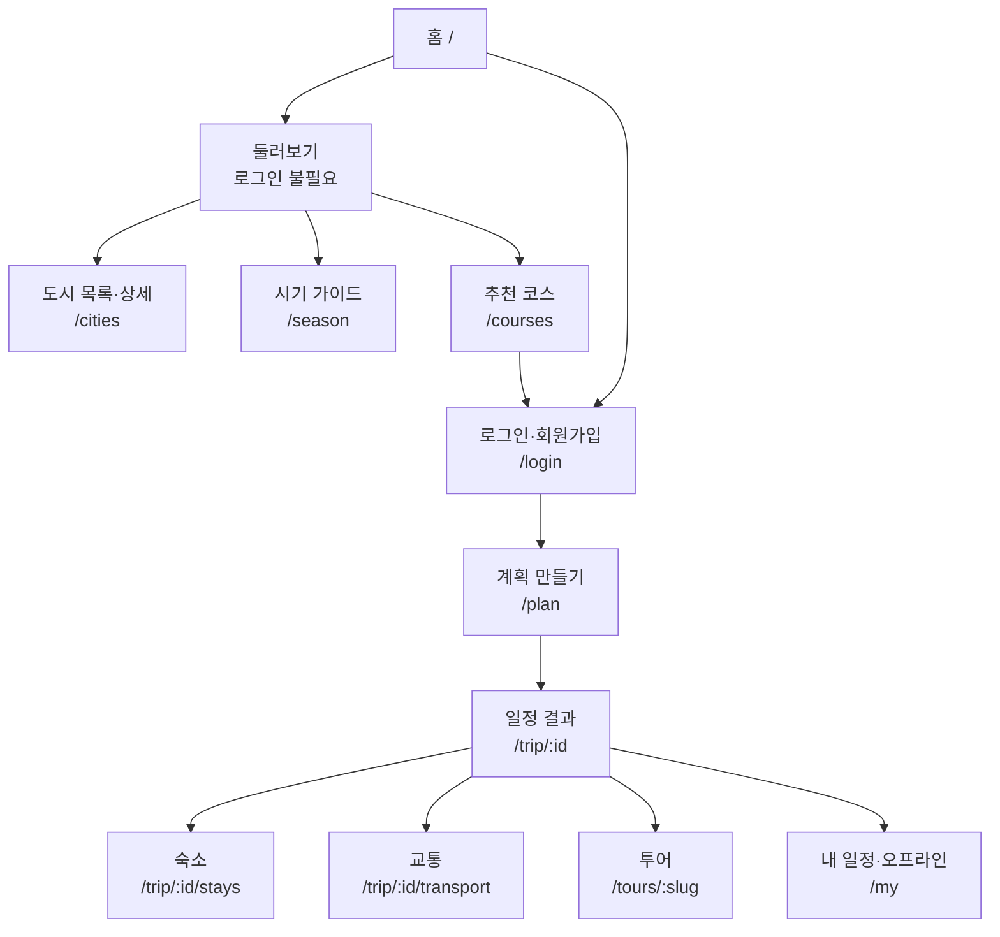
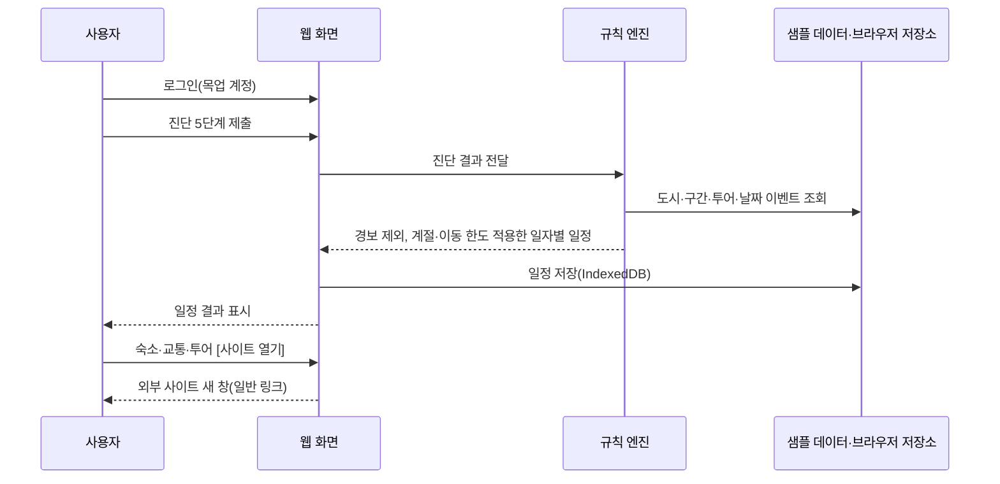
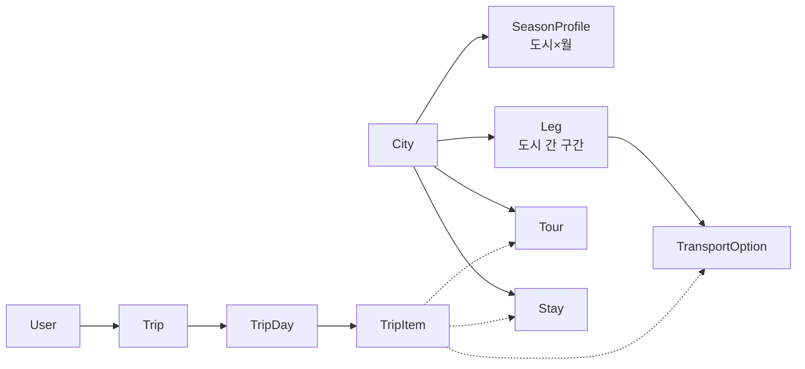
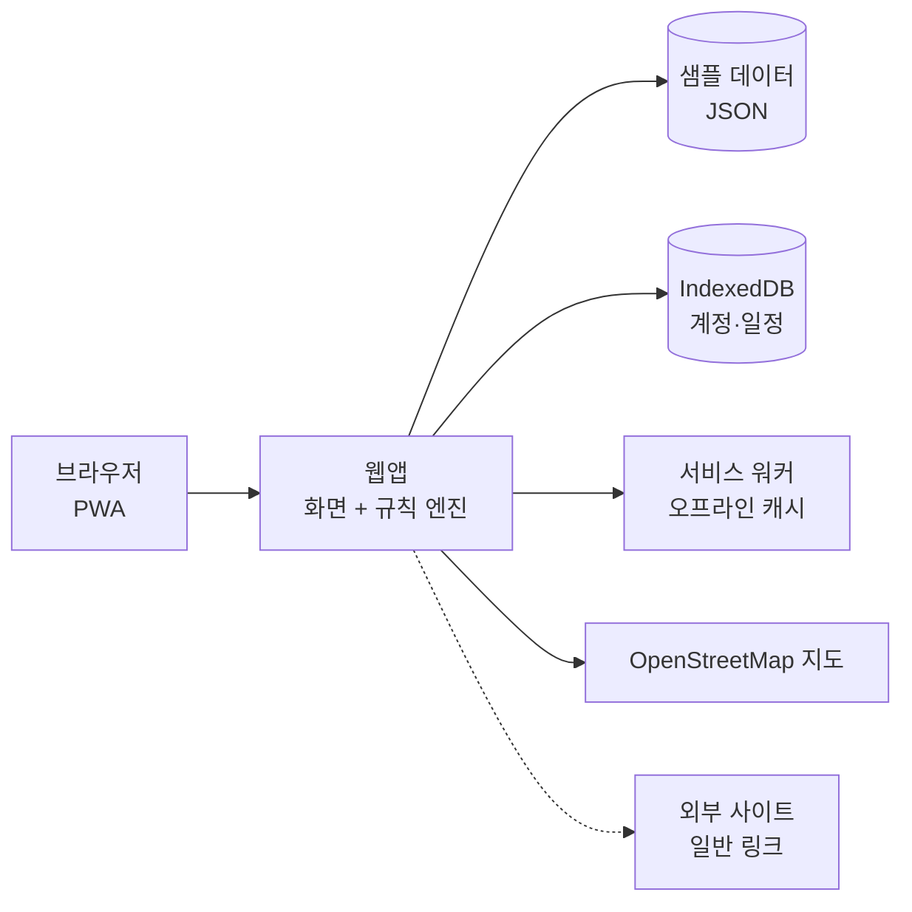

# Sabai Solow 웹사이트 설계 문서 (프로토타입)

Sep 23, 2026 · @다루마루

[혼자 누리는 태국 소도시 힐링 여행 — 서비스 기획안](https://claude.ai/artifact/YbZFdsYKGPPWA3rhDThHVR)을 바탕으로, **프로토타입** 웹의 디자인·화면·데이터·기술 구성을 정의합니다. 지금은 먼저 만들어 보는 단계이므로 외부 서비스 가입이나 제휴·API 연동이 필요한 기능은 빼고, 샘플 데이터와 일반 외부 링크로 전체 흐름을 구현합니다.

## 1. 프로토타입 범위

프로토타입은 로그인부터 계획 만들기, 일정 결과, 숙소·교통·투어 확인, 오프라인 저장까지 **한 번에 체험할 수 있는 웹**이 목표입니다. 외부 가입·연동이 필요한 부분은 화면만 만들고 동작은 샘플 데이터로 대신합니다.

| # | 기능 | 프로토타입 구현 방식 | 다음 단계(연동 후) |
| --- | --- | --- | --- |
| F0 | 회원가입·로그인 | 이메일+비밀번호 가입·로그인을 **브라우저 안에서만** 동작(목업 계정). 이메일 인증은 "인증 완료" 버튼으로 흉내. 구글·네이버 버튼은 화면만 두고 "준비 중" 표시 | 실제 서버 인증, 인증 메일 발송, 소셜 로그인 3종 |
| F1 | 여행 시기 설정·시기 가이드 | 기간을 넣으면 해당 계절·가격·위험·축제·금주일만 표시, 미정이면 시기 팁 화면 | 동일 |
| F2 | 여행 성향 진단 | 일수·예산·이동 강도·관심사 입력 | 동일 |
| F3 | 안심 일정 옵션 | 도착 21시 전, 야간버스 제외, 이동 5시간 이하 적용 | 동일 |
| F4 | 일정 생성 | **규칙 + 추천 코스 템플릿**으로 생성(AI 호출 없음) | AI로 조합·설명 생성 |
| F5 | 동선 지도 | 무료 오픈 지도(OpenStreetMap) 또는 정적 지도 이미지, 스폿마다 "구글맵에서 보기" 일반 링크 | 구글 지도 API |
| F6 | 금주일·축제·공휴일 알림 | 샘플 데이터(JSON)로 날짜 배지 표시 | 매년 갱신 자동화 |
| F7 | 숙소 추천 | 운영자가 구글맵에서 확인해 입력한 **샘플 숙소 데이터**(평점·구글맵 기준 최저가·최저가 사이트·확인 날짜), \[구글맵에서 최저가 보기\] 링크로 4.5+·10만원 이하 필터 | 구글 평점·OTA 가격 실시간 |
| F8 | 교통 연결 | 구간별 수단 비교 + 예약 사이트 **일반 링크**(제휴 추적 없음) | 제휴 딥링크 |
| F9 | 현지 투어 | 대표 4종(코끼리 목욕·쿠킹클래스·짚라인·트레킹) 카드와 일반 링크 | 제휴 링크, 투어 추가 |
| F10 | 혼행 안심 팩 | 비상 연락처, 태국어 목적지 카드 | 동일 |
| F11 | 오프라인 일정표 | PWA 오프라인 저장 + 브라우저 인쇄로 PDF | 서버 PDF |

**프로토타입에서 제외:** 실제 이메일 발송, 소셜 로그인 연동, AI(Claude API), 구글 지도·장소 API, 숙소·교통·투어 제휴와 가격 API, 외교부·환율 API 자동 연동, 카카오톡 공유·알림톡. 여행경보·환율·공휴일은 샘플 데이터에 입력하고 확인 날짜를 함께 적습니다.

## 2. 사이트맵과 URL 구조

사이트는 '계획 만들기'와 '둘러보기' 두 갈래이며, 둘 다 최종적으로 '내 일정'으로 모입니다.



| URL | 화면 | 로그인 | 비고 |
| --- | --- | --- | --- |
| / | 홈 | 불필요 | 계획 시작 버튼(비로그인이면 로그인으로), 추천 코스, 이달의 시기 배지 |
| /login | 로그인 | — | 이메일+비밀번호, 구글·네이버 버튼. 로그인 후 원래 가려던 화면으로 복귀 |
| /signup | 회원가입 | — | 이메일, 비밀번호, 약관·개인정보 동의 |
| /verify-email | 이메일 인증 | — | 인증 메일 링크 도착 화면, 재발송 버튼 |
| /reset-password | 비밀번호 재설정 | — | 메일 링크로 새 비밀번호 설정 |
| /plan | 계획 만들기(진단 5단계) | 필요 | 이메일 미인증 계정은 인증 안내로 이동 |
| /trip/:id | 일정 결과 | 필요(본인) | 공유 링크(/shared?d=…)는 로그인 없이 열람, '내 일정에 저장'으로 복사 |
| /trip/:id/stays?city= | 도시별 숙소 목록 | 필요 |  |
| /trip/:id/transport?leg= | 구간별 교통 비교 | 필요 |  |
| /cities, /cities/:slug | 도시 목록·상세 | 불필요 | 20개 도시, 검색 노출 대상 |
| /tours/:slug | 투어 상세 | 불필요 | 카드 클릭 시 모달, 직접 접근 시 페이지 |
| /season | 시기 가이드 | 불필요 | 기간 입력 시 해당 내용만, 미정이면 시기 팁 |
| /courses, /courses/:slug | 추천 코스 A\~H | 불필요 | '이 코스로 시작' → 로그인 → /plan에 값 채워 이동 |
| /safety | 혼행 안심 팩 | 불필요 | 오프라인 캐시 대상 |
| /my | 내 일정·계정 설정 | 필요 | 저장한 일정, 오프라인 저장 상태, 연결된 소셜 계정 |

## 3. 디자인 가이드

> 이 장의 색·글꼴·톤은 더 이상 쓰지 않습니다. 비주얼은 14장의 새 방향을 따르고, 이 장에서는 접근성·화면 상태·산출물 목록만 참고합니다.

디자인 목표는 '혼자여도 느긋하고 안심되는 여행'을 한 화면에서 느끼게 하는 것입니다. 아래 색·글꼴 값은 출발점이며, 디자이너가 시안에서 확정합니다.

### 3-1. 디자인 원칙

1. **한눈에 결정:** 카드 맨 위에 결론(도시·기간·이동 시간·가격)을 두고, 자세한 내용은 펼쳐서 보게 함
2. **안심 정보는 가까이:** 금주일·여행경보·야간 이동 같은 주의 사항은 해당 날짜·카드 바로 옆에 표시
3. **느긋한 분위기:** 넓은 여백, 둥근 모서리, 부드러운 색. 반짝이는 효과·과한 애니메이션은 쓰지 않음
4. **읽기 쉬움:** 30\~50대를 위해 본문 16px 이상, 대비 4.5:1 이상, 버튼·터치 영역 44px 이상
5. **오프라인에서도 쓸 수 있음:** 일정표·태국어 카드·비상 연락처는 지도·사진 없이도 이해되도록 글자 중심으로 설계

### 3-2. 톤앤매너

- **분위기:** 차분하고 따뜻함. 북부의 차밭·새벽 물안개·목조 가옥, 남부의 조용한 바다
- **사진:** 사람이 적은 풍경, 혼자 걷는 뒷모습, 아침·해 질 녘 빛. 프로토타입 테스트 데이터도 실사 이미지로 채움(8장 테스트 이미지 기준)
- **문구:** 짧은 존댓말, 필요한 경고는 담담하게(예: "이 날은 술을 팔지 않아요"). 느낌표·과장된 표현은 쓰지 않음
- **로고:** 워드마크 "Sabai Solow". 'Sabai Solo'는 기본색(ink 또는 primary), 끝 글자 'w'만 포인트 색(accent, 사프란 주황)으로 칠해 Solo와 Slow가 함께 읽히게 함. 가운뎅점이나 철자 변형은 쓰지 않고, 흑백·작은 크기에서는 한 색으로 써도 이름이 그대로 읽힘. 부제는 "slow & solo" 또는 "혼자 누리는 태국 소도시 힐링 여행"

### 3-3. 색과 글꼴(초안)

| 토큰 | 용도 | 라이트 | 다크 |
| --- | --- | --- | --- |
| primary | 주 버튼, 선택 상태 | 차밭 초록 #2F5D50 | #7FB3A2 |
| accent | 강조, 추천 표시 | 사프란 주황 #D9822B | #E8A460 |
| bg | 배경 | 모래색 #F7F3EC | #161B1D |
| surface | 카드 | #FFFFFF | #20272A |
| ink | 본문 글자 | #1F2A2E | #E9EEEC |
| muted | 보조 글자 | #5E6B70 | #9AA7AB |

**의미 색(배지):** 추천 시기(초록), 주의 시기(호박), 알뜰 시기(파랑), 금주일(보라), 축제(분홍), 여행경보·위험(빨강). 모든 배지는 색과 함께 글자·아이콘을 넣어 색맹도 구분되게 함.

**글꼴:** Pretendard(무료 오픈 폰트). 제목 24/20/18px 굵게, 본문 16px, 보조 14px, 숫자(시간·가격)는 고정폭 숫자. **아이콘:** 선형 오픈소스 아이콘(예: Lucide).

### 3-4. 핵심 컴포넌트

| 컴포넌트 | 쓰이는 곳 | 내용·상태 |
| --- | --- | --- |
| 진단 단계 카드 | 계획 만들기 | 질문, 선택지(칩·라디오·슬라이더), 진행 막대, 이전/다음 |
| 기간 정보 패널 | 계획 만들기, 시기 가이드, 일정 결과 | 지역별 계절 배지, 가격 경향, 위험, 날짜 이벤트. 펼침/접힘 |
| 시기 팁 카드 | 시기 가이드(미정) | 기간, 배지, 장점·주의 한 줄, \[이 시기로 계획하기\] |
| 배지 | 전체 | 계절 3종, 금주일, 축제, 공휴일, 여행경보, 혼행 태그 |
| 날짜 카드 | 일정 결과 | Day N·날짜·도시, 오전/오후/저녁 스폿, 배지, 숙소·투어 슬롯. 기본/편집/경고 상태 |
| 이동 구간 카드 | 일정 결과, 교통 | 출발→도착, 수단 아이콘, 소요 시간, 야간 여부, 여성 전용칸 표시 |
| 숙소 카드 | 숙소 목록 | 실사 사진, 이름, 평점·리뷰 수, 구글맵 기준 최저가(원·바트)와 사이트명, 확인 날짜, 거리, 혼행 태그, \[일정에 담기\] |
| 투어 카드 + 바텀시트 | 일정 결과, 도시 상세 | 카드: 사진·종류·도시·소요 시간. 펼침: 어떤 서비스인가 / 준비할 것 / 주의할 점 / 추천 포인트 4블록 + 외부 링크 |
| 알림 띠 | 상단 | 오프라인, 여행경보 변경, 금주일 전날 안내 |
| 태국어 목적지 카드 | 안심 팩, 일정 | 크게 보기 모드(가로 전체 화면), 태국어 주소 + 한글 설명 |
| 지도 핀·경로 | 동선 지도 | 날짜별 색, 숫자 핀, 이동 경로 선 |
| 하단 탭·고정 버튼 | 전체 | 홈·계획·둘러보기·내 일정 / \[저장\] \[PDF\] \[오프라인 저장\] |

### 3-5. 화면 상태

모든 화면에 **기본 · 로딩 · 빈 상태 · 오류 · 오프라인** 5가지 상태를 디자인합니다. 특히 다음 상태는 별도 시안이 필요합니다.

- 일정 생성 중(단계별 진행 문구: "도시 고르는 중 → 이동 경로 맞추는 중 → 숙소·투어 붙이는 중")
- 조건에 맞는 숙소가 없음(예산 올리기·인근 도시 제안)
- 규칙 위반 편집(예: 이동 6시간 초과 경고 후 그대로 진행/되돌리기)
- 투어 운영 제한 기간(예: 우기 트레킹 주의)
- 오프라인에서 외부 링크 버튼 비활성

### 3-6. 레이아웃

- **모바일(360\~767px):** 한 단, 하단 탭 4개, 투어·숙소 상세는 바텀시트
- **태블릿(768\~1279px):** 두 단(목록 + 상세)
- **데스크톱(1280px\~):** 왼쪽 목록·일정, 오른쪽 지도 고정. 상단 내비게이션, 상세는 모달

### 3-7. 디자인 산출물 목록

| 우선순위 | 화면 | 해상도 | 포함 상태 |
| --- | --- | --- | --- |
| 1 | 홈 | 모바일·데스크톱 | 기본 |
| 1 | 로그인·회원가입·이메일 인증 안내 | 모바일 | 기본, 입력 오류, 소셜 "준비 중" |
| 1 | 계획 만들기 5단계 + 기간 정보 패널 | 모바일·데스크톱 | 단계별, 미정 선택 시 시기 팁 |
| 1 | 일정 생성 중 | 모바일 | 로딩, 실패 |
| 1 | 일정 결과(일자별·지도 탭) | 모바일·데스크톱 | 기본, 편집, 규칙 경고, 배지 표시 |
| 1 | 투어 카드 + 바텀시트 | 모바일·데스크톱(모달) | 기본, 시기 주의 |
| 2 | 숙소 목록 | 모바일 | 기본, 필터, 결과 없음 |
| 2 | 교통 비교 | 모바일 | 기본, 안심 일정 ON |
| 2 | 시기 가이드(기간 입력 / 미정 팁) | 모바일·데스크톱 | 두 가지 모드 |
| 2 | 내 일정 + 오프라인 상태 | 모바일 | 온라인, 오프라인 |
| 3 | 도시 목록·상세, 추천 코스 | 모바일·데스크톱 | 기본 |
| 3 | 혼행 안심 팩 + 태국어 카드 크게 보기 | 모바일 | 기본, 오프라인 |
| 3 | PDF 인쇄 레이아웃 | A4 세로 | 표지, 하루 1쪽, 마지막 장 |

디자인 도구는 가입이 필요 없는 방식을 우선하되, 디자이너가 쓰던 도구를 그대로 써도 됩니다.

## 4. 화면별 설계

모든 화면은 모바일(360px)을 기준으로 먼저 설계하고, 태블릿·데스크톱에서는 지도와 목록을 나란히 보여 줍니다. 하단 탭은 **홈 · 계획 · 둘러보기 · 내 일정** 4개입니다.

### 4-0. 로그인·회원가입 (/login, /signup)

- 로그인 화면: \[Google로 계속하기\] \[네이버로 계속하기\] 버튼, 그 아래 이메일·비밀번호 입력과 \[비밀번호 찾기\]
- 회원가입: 이메일, 비밀번호(8자 이상, 영문·숫자 포함), 비밀번호 확인, 필수 약관·개인정보 동의, 선택 마케팅 동의
- 가입 후 이메일 인증 안내 화면(/verify-email): "메일함을 확인해 주세요", \[인증 메일 다시 보내기\]
- 인증 완료 후 /plan으로 이동. 비로그인 상태에서 \[계획 만들기\]를 누르면 로그인 화면으로 보내고, 로그인 후 원래 화면으로 복귀
- **프로토타입 동작:** 계정은 브라우저(IndexedDB)에만 저장. 인증 메일 대신 안내 화면에 \[인증 완료로 처리(테스트)\] 버튼을 둠. 소셜 버튼은 누르면 "준비 중인 기능이에요" 안내

### 4-1. 홈 (/)

- 히어로: "혼자 누리는 태국 소도시 힐링 여행" + \[내 여행 계획 만들기\] 버튼
- 이달의 시기 배지: 오늘 날짜 기준 계절(성수기/우기/폭염/연무)과 한 줄 안내
- 추천 코스 카드 8개(A\~H): 일수, 도시 수, 대표 사진, 혼행 적합도
- 다가오는 금주일·축제 2\~3개

### 4-2. 계획 만들기 (/plan)

한 화면에 한 단계씩 보여 주는 7단계(시기 → 일수·예산 → 도시 → 이동 강도 → 관심사 → 안심 일정 → 확인)이며, 상단 진행 표시(가 본 단계는 바로 이동)와 \[처음부터\]/\[이전\]/\[다음\] 버튼을 둡니다. 도시 단계에서 '추천 코스로' 또는 '도시 직접 고르기'를 고르고, 직접 고르면 규칙 엔진이 이동 시간이 짧은 순서로 잇고 박수를 나눕니다(직통이 없으면 가장 빠른 경유 도시를 거침).

1. **여행 시기:** 날짜 지정 / 월만 지정 / 미정
   - 날짜나 월을 넣으면 바로 아래에 **"이 기간의 여행 정보"** 패널을 띄움: 지역별 계절 배지, 가격 경향, 위험 요소, 기간에 걸린 축제·금주일·공휴일
   - 미정이면 패널 대신 **\[시기 팁 보기\]** 버튼을 보여 주고, 누르면 월별 추천·주의 시기를 요약한 팁을 따로 열어 줌. 팁에서 월을 고르면 그 월로 진행
2. **일수·예산:** 여행 일수(3\~21일), 1박 숙소 예산 상한(기본 10만원)
3. **이동 강도:** 여유 / 보통 / 부지런, 야간 이동 허용 여부
4. **관심사(복수 선택):** 사원·역사, 카페·미식, 자연·트레킹, 바다·섬, 요가·휴식, 워케이션
5. **안심 일정 옵션:** 켜기/끄기 스위치와 적용되는 규칙 설명. 성별은 묻지 않음

&#91;일정 만들기\]를 누르면 생성 중 화면(약 5\~15초)을 거쳐 /trip/:id로 이동합니다.

### 4-3. 일정 결과 (/trip/:id)

- 상단 요약: 기간, 도시 수, 총 이동 시간, 계절 배지, 예상 숙박비 합계
- 탭: **일자별 · 지도 · 숙소 · 교통 · 투어**
- 일자별 카드: 도시, 오전/오후/저녁 스폿, 이동 구간(수단·소요 시간), 숙소 선택 상태, 추천 투어 1\~2개
- 날짜 카드 배지: 금주일, 축제, 공휴일, 여행경보 변경(색상과 아이콘으로 구분)
- 편집: 도시 순서 드래그, 체류일 +/−, 도시 추가/삭제(재계산 시 규칙 위반은 경고)
- 하단 고정 버튼: \[일정 저장\] \[PDF\] \[오프라인에 저장\] \[링크 복사\]

### 4-4. 숙소 목록 (/trip/:id/stays)

- 도시 탭, 가격대 필터(3만원 이하 / 3\~6만원 / 6\~10만원), 혼행 태그 필터
- 카드: 실사 사진, 이름, 구글맵 평점·리뷰 수, **구글맵 기준 1박 최저가(원·바트)와 최저가 사이트명**, 정보 확인 날짜, 터미널/역까지 거리, 혼행 태그
- &#91;구글맵에서 최저가 보기\]: 구글맵의 해당 숙소 페이지를 열어, 사용자가 가격 비교 목록에서 최저가 사이트로 바로 이동. \[일정에 담기\]를 누르면 해당 날짜에 표시
- **프로토타입 데이터:** 도시당 3\~6곳의 테스트 숙소를 운영자가 구글맵에서 확인해 입력(평점·최저가·사이트명·확인 날짜, "가격은 날짜·시기에 따라 바뀜" 안내)

### 4-5. 교통 비교 (/trip/:id/transport)

- 구간 선택 → 기차·버스·미니밴·배·항공을 소요 시간, 대략 가격, 출발 시간대, 혼행 팁과 함께 비교
- 안심 일정이 켜져 있으면 21시 이후 도착편·야간버스는 흐리게 표시하고 이유를 보여 줌
- &#91;예약 사이트 열기\] → 12Go·태국철도 D-Ticket·BusX 등 공개 사이트로 가는 일반 링크(새 창). 검색 조건은 사용자가 직접 입력

### 4-6. 투어 카드와 상세 (/tours/:slug)

- 프로토타입 투어는 대표 4종: **코끼리 목욕 · 쿠킹클래스 · 짚라인 · 트레킹**(내용은 기획안 11장)
- 카드: 실사 사진, 투어 종류, 가능한 도시, 소요 시간, 대략 가격대
- 카드를 누르면 바텀시트(모바일)나 모달(데스크톱)로 펼침: **어떤 서비스인가 · 준비할 것 · 주의할 점 · 추천 포인트** 4개 블록
- 계절 주의: 여행 날짜가 우기면 트레킹·짚라인에 "미끄럽고 거머리가 많은 시기" 안내
- 코끼리 목욕은 **코끼리 타기·쇼가 없는 보호소**만 소개하고, 카드에 "코끼리 탑승 없음" 표시
- &#91;예약 사이트 열기\] → 투어 플랫폼 검색 결과나 업체 공식 사이트로 가는 일반 링크. \[일정에 담기\]

### 4-7. 도시 상세 (/cities/:slug)

- 한 줄 성격, 혼행 적합도, 추천 체류, 좋은 시기, 대표 볼거리 지도, 대표 투어, 가는 법, 안전 메모
- &#91;이 도시 넣어서 계획하기\]

### 4-8. 시기 가이드 (/season)

- **기간을 넣은 경우:** 상단에 출발일\~귀국일(또는 월)을 입력하면 그 기간에 해당하는 내용만 출력
  - 지역별(북부·중부·걸프·안다만) 계절 배지와 날씨
  - 가격 경향(성수기·비수기, 축제 기간 할증)
  - 위험 요소(우기 산사태, 연무, 폭염, 페리 결항 등)
  - 기간에 걸린 축제·금주일·선거일·공휴일 목록(날짜순)
  - 이 기간에 추천하는 도시와 피하면 좋은 도시
- **미정인 경우:** 기간 입력 대신 **시기 팁** 탭을 보여 줌
  - 최적기(11\~2월, 가격 상승), 우기(6\~10월, 저렴하지만 위험), 폭염기(3\~5월), 북부 연무기(2월 말\~4월), 남부 걸프 우기(10\~12월)를 카드로 요약
  - 카드마다 \[이 시기로 계획하기\] 버튼
- 일정 결과(/trip/:id) 상단에도 같은 "이 기간의 여행 정보" 요약을 접이식으로 표시

### 4-9. 혼행 안심 팩 (/safety)

- 관광경찰 1155, 주태국 한국대사관 연락처, 숙소 주소 태국어 카드(일정에서 자동 생성), 여행경보 요약, 야간 이동 팁
- 오프라인 저장 대상

### 4-10. 내 일정 (/my)

- 저장된 일정 목록, 오프라인 저장 여부, 마지막 동기화 시간
- 계정 설정: 이메일·비밀번호 변경, 연결된 소셜 계정(구글·네이버) 추가·해제, 회원 탈퇴(일정 데이터 즉시 삭제)

## 5. 핵심 사용자 흐름

프로토타입의 일정 생성은 브라우저 안에서 끝납니다. 규칙 엔진이 샘플 데이터에서 도시·구간·투어 후보를 걸러내고, 추천 코스 템플릿을 여행 일수에 맞게 늘리거나 줄여 일정을 만듭니다.

진단을 시작하기 전에 로그인과 이메일 인증 여부를 확인합니다(프로토타입에서는 브라우저에 저장된 목업 계정).



다음 단계에서는 규칙 엔진을 서버로 옮기고, AI가 후보 안에서 조합·설명을 만들며, 외부 링크는 제휴 링크로 바뀝니다.

## 6. 일정 생성 규칙

규칙 엔진은 아래 순서로 후보를 걸러내고, 사용자가 일정을 편집할 때도 같은 규칙으로 다시 검사합니다. 값은 설정 파일(JSON)로 두어 쉽게 바꿀 수 있게 합니다.

| 순서 | 규칙 | 기본값 | 안심 일정 ON |
| --- | --- | --- | --- |
| 1 | 여행경보 제외 | 외교부 경보 2단계 이상·특별여행주의보 지역의 도시·환승지·투어 제외 | 동일 |
| 2 | 계절 적합도 | 여행 월의 도시별 계절 점수가 낮은 도시는 순위를 내림(예: 5\~10월 꼬리뻬, 2월 말\~4월 북부 연무) | 동일 |
| 3 | 하루 최대 이동 | 6시간(야간열차 침대칸은 제외) | 5시간 |
| 4 | 도착 시간 | 제한 없음(23시 이후 도착은 경고) | 21시 이전만 |
| 5 | 야간 이동 | 진단에서 허용한 경우 야간버스·야간열차 사용 | 야간열차 침대칸만, 여성 전용칸 있는 열차 우선 |
| 6 | 최소 체류 | 도시당 1박 이상, 연속 이동일은 2일까지 | 동일 |
| 7 | 이동 강도 | 여유: 도시당 평균 3박 / 보통: 2박 / 부지런: 1.5박 | 동일 |
| 8 | 우기 예비일 | 6\~10월 산간 도로가 포함되면 예비일 1일 추가 제안 | 동일 |
| 9 | 폭염 재배치 | 3\~5월에는 야외 스폿을 오전·야간으로 옮김 | 동일 |
| 10 | 날짜 배지 | 금주일·선거일·축제·공휴일을 날짜 카드에 표시, 축제 기간 숙소는 조기 예약 경고 | 동일 |
| 11 | 투어 배치 | 체류 2박 이상 도시에 하루 투어 1개 추천, 운영 제한 기간 투어는 제외 | 소규모·픽업 포함 투어 우선 |

**템플릿 기반 생성 방식**

1. 관심사·여행 월·일수로 추천 코스 A\~H에 점수를 매겨 가장 맞는 코스 1개를 고름(계절 '알뜰·주의' 도시가 많으면 감점)
2. 일수가 남으면 같은 지역의 추가 도시를 붙이거나 체류를 늘리고, 모자라면 체류가 긴 도시부터 줄임
3. 각 도시의 대표 스폿을 오전·오후·저녁에 배치(폭염기에는 야외 스폿을 오전·저녁으로)
4. 구간마다 규칙에 맞는 교통수단 중 가장 짧은 것을 고름
5. 체류 2박 이상 도시에 투어 4종 중 관심사에 맞는 1개를 추천
6. 날짜 이벤트를 맞춰 배지를 붙이고, 규칙 위반이 남으면 경고로 표시

## 7. 데이터 모델

프로토타입의 데이터는 두 가지입니다. 운영자가 만드는 **샘플 콘텐츠**(JSON 파일: 도시·구간·숙소·투어·날짜 이벤트·경보)와, 사용자가 만드는 **계정·일정**(브라우저 IndexedDB)입니다. 다음 단계에서 같은 구조를 그대로 서버 DB로 옮깁니다.



| 엔터티 | 주요 필드 | 저장 위치 | 비고 |
| --- | --- | --- | --- |
| City | id, slug, name\_ko, name\_en, region, lat/lng, solo\_score(1\~5), stay\_nights, summary, highlights\[\], safety\_note, advisory\_level, images\[\] | 샘플 JSON | 20개 도시 |
| SeasonProfile | city\_id, month(1\~12), badge(추천/주의/알뜰), weather, price\_trend, risks\[\] | 샘플 JSON | 시기 가이드·규칙 2번 |
| SeasonTip | id, period(예: 11\~2월), badge, summary, pros, cautions | 샘플 JSON | 미정자용 시기 팁 |
| Leg | id, from\_city, to\_city, notes | 샘플 JSON | 양방향 각각 |
| TransportOption | leg\_id, mode(train/bus/night\_bus/minivan/ferry/flight), duration\_min, price\_min/max\_thb, departs, is\_overnight, has\_ladies\_coach, link\_url, solo\_tip | 샘플 JSON | 기획안 5장 어림값 |
| Stay | id, city\_id, name, google\_rating, review\_count, lowest\_price\_krw, lowest\_price\_thb, lowest\_price\_site(구글맵에 표시된 최저가 사이트), checked\_on(확인 날짜), distance\_note, solo\_tags\[\], maps\_url(구글맵 숙소 페이지), images\[\] | 샘플 JSON | 운영자가 구글맵에서 확인해 입력 |
| Tour | id, slug, type(elephant\_bath/cooking/zipline/trekking), cities\[\], title, duration, price\_band, description, prepare\[\], cautions\[\], highlights\[\], season\_limits\[\], no\_riding(코끼리만), link\_url, images\[\] | 샘플 JSON | 4종 |
| CalendarEvent | date\_from, date\_to, type(no\_alcohol/election/festival/holiday), title, city\_ids\[\], message, source\_url | 샘플 JSON | 2026년 데이터 |
| Advisory | region\_desc, level(1\~4, special), checked\_on | 샘플 JSON | 외교부 사이트 확인 후 수동 입력 |
| User | id, email, password\_hash, email\_verified(목업), created\_at | IndexedDB | 프로토타입 전용 목업 계정 |
| Trip | id, user\_id, inputs(진단 결과), start\_date?, month?, safe\_mode, created\_at | IndexedDB |  |
| TripDay | trip\_id, day\_no, date?, city\_id, badges\[\] | IndexedDB |  |
| TripItem | day\_id, slot(오전/오후/저녁/이동/숙박), type(spot/tour/stay/transport), ref\_id, note(예약 번호 메모 등) | IndexedDB |  |

## 8. 데이터 출처와 다음 단계 연동

프로토타입은 **가입·API 키 없이** 동작합니다. 샘플 데이터는 운영자가 공개 사이트에서 확인해 입력하고, 각 항목에 확인 날짜를 남깁니다.

### 프로토타입에서 쓰는 것(가입 불필요)

| 항목 | 방식 |
| --- | --- |
| 지도 | OpenStreetMap 지도(Leaflet) 또는 정적 이미지. 스폿·숙소마다 구글맵 검색 URL 일반 링크 |
| 숙소 평점·가격 | 구글맵 숙소 정보에 나온 평점과 1박 최저가·최저가 사이트명을 운영자가 확인해 입력. \[구글맵에서 최저가 보기\] 링크로 사용자가 최저가 사이트로 이동("확인일 기준" 표시) |
| 교통·투어 예약 | 예약 사이트 도메인으로 가는 일반 링크(제휴 추적 없음) |
| 여행경보 | 외교부 해외안전여행 사이트 내용을 수동 입력 |
| 환율 | 고정값(예: 1바트 = 42원)과 적용 날짜를 설정 파일에 둠 |
| 공휴일·금주일·축제 | 기획안 7장의 2026년 날짜를 샘플로 입력 |
| 일정 생성 | 규칙 엔진 + 추천 코스 템플릿(6장) |
| 글꼴·아이콘 | Pretendard, Lucide(오픈 라이선스, 파일을 프로젝트에 포함) |

**테스트 이미지:** 도시·숙소·투어·코스 카드는 **실사 이미지**로 채웁니다. 무료로 상업적 이용이 가능한 라이선스의 사진이나 직접 촬영한 사진만 쓰고, 이미지마다 출처(촬영자·사이트)와 라이선스를 images\[\]에 함께 기록합니다. 숙소 사진은 저작권이 숙소나 예약 사이트에 있을 수 있으므로 테스트용으로만 쓰고 공개 전에 교체합니다.

### 다음 단계에서 연동할 것

| 구분 | 연동 대상 | 필요한 준비 |
| --- | --- | --- |
| 로그인 | 서버 인증, 인증 메일 발송, 구글·네이버 로그인 | 각 개발자 센터 앱 등록·검수, 메일 발송 서비스 |
| 지도·장소 | 구글 지도·Places·Routes API | API 키, 결제 수단 등록 |
| 제휴 | 숙소(아고다 등), 교통(12Go 등), 투어(Klook 등) 제휴 링크·가격 | 제휴 프로그램 신청·승인 |
| 공공 데이터 | [외교부 여행경보 API](https://www.data.go.kr/data/15076237/openapi.do), 수출입은행 환율 API | 공공데이터포털 활용 신청 |
| AI | Claude API(일정 조합·설명) | API 키 |
| 배포 | 웹 호스팅, DB | 호스팅 계정 |

## 9. 오프라인 일정표

오프라인 일정표는 \*\*PWA(홈 화면에 설치하는 웹앱)\*\*와 **PDF** 두 가지로 제공해, 산간·섬에서 데이터가 끊겨도 일정·바우처·비상 연락처를 볼 수 있게 합니다.

### 저장 대상

| 항목 | PWA | PDF |
| --- | --- | --- |
| 일자별 일정(스폿·이동·숙소·투어) | 있음 | 있음 |
| 날짜 배지(금주일·축제·공휴일) | 있음 | 있음 |
| 투어 카드 4개 블록(설명·준비물·주의점·추천) | 있음 | 있음 |
| 태국어 목적지 카드(숙소·터미널 주소) | 있음(크게 보기) | 있음 |
| 예약 번호 메모(사용자 입력) | 있음 | 있음 |
| 혼행 안심 팩(비상 연락처) | 있음 | 있음 |
| 동선 지도 | 정적 지도 이미지 | 정적 지도 이미지 |
| 숙소 가격·구글 평점 | 저장하지 않음(온라인에서만) | 저장하지 않음 |

### PWA 동작

- 매니페스트 + 서비스 워커(Workbox)로 앱 기본 화면(앱 셸)과 샘플 데이터를 캐시
- &#91;오프라인에 저장\]을 누르면 일정과 이미지를 IndexedDB·Cache Storage에 저장하고 "오프라인 준비 완료" 표시
- 오프라인일 때 상단에 "오프라인 — 저장된 일정을 보고 있어요" 띠를 띄우고, 외부 사이트 버튼은 비활성화
- 예약 번호 메모는 오프라인에서도 수정·저장 가능
- 프로토타입에서는 계정·일정이 이 기기에만 저장되므로, 내 일정 화면에 "브라우저 데이터를 지우면 사라져요" 안내
- iOS는 Safari의 \[홈 화면에 추가\] 안내를 따로 보여 줌

### PDF

- 프로토타입은 인쇄용 화면(/trip/:id/print)을 만들고 브라우저 \[인쇄 → PDF로 저장\]을 씁니다(서버 불필요)
- A4 세로, 하루 1쪽. 표지는 여행 요약 + 이 기간의 여행 정보, 마지막 장은 비상 연락처와 태국어 목적지 카드
- 한글 글꼴 내장(Pretendard), 인쇄용 CSS로 버튼·탭은 숨김
- 다음 단계에서 서버 PDF 생성으로 바꿈

## 10. 기술 구성

프로토타입은 **서버 없이 브라우저에서 돌아가는 웹앱**으로 만들어, 로컬 컴퓨터에서 바로 실행하고 필요하면 정적 파일로 올릴 수 있게 합니다. 다음 단계에서 같은 코드에 서버·DB를 붙입니다.



| 영역 | 선택 | 이유 |
| --- | --- | --- |
| 화면 | Next.js(정적 내보내기) + TypeScript + Tailwind CSS | 나중에 서버 기능을 붙이기 쉬움, 디자인 토큰을 그대로 적용 |
| 상태·저장 | IndexedDB(Dexie 등 라이브러리) | 계정·일정을 기기에 저장, 오프라인에서도 동작 |
| 비밀번호(목업) | 브라우저 Web Crypto로 해시 후 저장 | 평문 저장 금지. 실제 보안은 다음 단계 서버 인증에서 |
| 지도 | Leaflet + OpenStreetMap 타일 | 키 없이 사용. 타일 이용 정책(출처 표기, 과도한 요청 금지) 준수 |
| 오프라인 | Workbox 서비스 워커 + 웹 앱 매니페스트 | 9장 참고 |
| PDF | 인쇄용 CSS + 브라우저 인쇄 | 서버 불필요 |
| 샘플 데이터 | /data/\*.json(도시, 구간, 숙소, 투어, 이벤트, 경보, 시기, 설정) | 코드 수정 없이 내용 교체 |
| 테스트 | 규칙 엔진 단위 테스트, 주요 흐름 화면 테스트 | 추천 코스 8개 × 월 12개 조합 검증 |

**내부 모듈(다음 단계에 API로 교체)**

| 모듈 | 프로토타입 | 다음 단계 |
| --- | --- | --- |
| auth | IndexedDB 목업 계정 | 서버 인증 + 소셜 로그인 |
| season | JSON에서 기간별 조회, 미정 팁 | /api/season |
| planner | 규칙 엔진 + 템플릿 | /api/trips(+AI) |
| stays / transport / tours | JSON 필터 | /api/stays 등 + 제휴 데이터 |
| storage | IndexedDB | 서버 DB 동기화 |

화면은 이 모듈들의 공통 인터페이스만 부르므로, 다음 단계에서 모듈 안쪽만 바꾸면 됩니다.

## 11. 비기능 요구사항

| 영역 | 요구사항 |
| --- | --- |
| 성능 | 모바일에서 첨 화면 2.5초 이내, 일정 생성 3초 이내(진행 화면은 디자인 확인을 위해 최소 1.5초 표시) |
| 반응형 | 360px·768px·1280px 기준, 가로 스크롤 없음, 터치 영역 44px 이상 |
| 접근성 | WCAG 2.1 AA: 대비 4.5:1, 키보드로 모든 기능 사용, 배지는 색+글자, 본문 16px 이상 |
| 다크 모드 | 기기 설정을 따르고 직접 전환 가능(3장 색 토큰) |
| 목업 계정 보호 | 비밀번호는 해시로만 저장, 화면에 "테스트용 계정이며 이 기기에만 저장돼요" 안내, 실제 사용하는 비밀번호를 쓰지 말라는 안내 |
| 개인정보 | 이메일 외 개인정보는 받지 않음(성별·나이 없음), 데이터는 외부로 전송하지 않음. \[내 데이터 모두 삭제\] 버튼 |
| 정보 정확성 | 숙소 평점·가격, 교통 시간, 투어 내용에 "확인일 기준, 바뀔 수 있음" 표시 |
| 외부 링크 | 새 창으로 열고 rel="noopener" 적용, 링크 대상 도메인은 설정 파일에 등록된 것만 |
| 지도 출처 | OpenStreetMap 출처 문구를 지도 아래에 표시 |

## 12. 개발 일정

프로토타입은 디자인 포함 **약 8주**를 예상하며, 샘플 데이터 입력은 디자인·개발과 동시에 진행합니다.

| 주차 | 단계 | 산출물 |
| --- | --- | --- |
| 1\~2 | 디자인 | 디자인 가이드 확정(색·글꼴·컴포넌트), 우선순위 1 화면 시안(3-7) |
| 2\~3 | 디자인 + 데이터 | 우선순위 2·3 화면 시안, 도시 20개·구간·투어 4종·샘플 숙소·이벤트 JSON |
| 3\~4 | 개발: 기반 | 프로젝트 구조, 디자인 토큰·공통 컴포넌트, 목업 로그인·회원가입 |
| 5 | 개발: 계획 | 진단 5단계, 기간 정보 패널·시기 팁, 규칙 엔진·템플릿 생성 |
| 6 | 개발: 결과 | 일정 결과·편집, 날짜 배지, 지도, 숙소·교통·투어 화면 |
| 7 | 개발: 오프라인 | PWA, 인쇄용 PDF, 안심 팩, 내 일정 |
| 8 | 점검·사용자 테스트 | 접근성·반응형 점검, 30\~50대 혼행자 5명 내외 테스트, 수정 목록 |

**완료 기준:** 로그인 → 진단 → 일정 결과 → 숙소·교통·투어 확인 → 오프라인 저장·PDF까지 외부 가입 없이 끝까지 동작하고, 추천 코스 8개로 일정이 규칙에 맞게 만들어지면 완료.

## 13. 열린 질문과 출처

- [ ] 디자인 도구와 시안 공유 방식은 무엇으로 할지?
- [ ] 테스트 숙소를 도시당 몇 곳 넣을지(제안: 3\~6곳)
- [x] 서비스명: Sabai Solow로 확정(로고는 'w'만 포인트 색). 도메인·상표 확인은 다음 단계

**출처**

- [혼자 누리는 태국 소도시 힐링 여행 — 서비스 기획안](https://claude.ai/artifact/YbZFdsYKGPPWA3rhDThHVR)
- [외교부\_국가·지역별 여행경보 API(공공데이터포털)](https://www.data.go.kr/data/15076237/openapi.do) — 다음 단계용
- [외교부 해외안전여행 — 태국](https://0404.go.kr/ntnSafetyInfo/260/detail) — 프로토타입 경보 수동 입력 기준

## 14. Claude Design 핸드오프 브리프

이 장은 Claude Design에서 웹디자인을 **처음부터 새로** 진행하기 위한 브리프입니다. 기존 캔버스 시안과 3장 디자인 가이드(색·글꼴·톤)는 **모두 무시**하고, 화면에 들어갈 기능과 내용만 4장을 따릅니다. 목표는 트렌디함입니다.

### 14-1. 레퍼런스에서 가져올 점

| 레퍼런스 | 특징 | Sabai Solow에 가져올 것 |
| --- | --- | --- |
| [App State Department of Art](https://www.awwwards.com/sites/app-state-department-of-art) | 사진 타일을 바둑판처럼 어긋나게 배치한 모자이크, 큰 배경 이미지, 강한 타이포그래피, 들어갈 때마다 바뀌는 사진 | 홈·도시 목록의 실사 사진 모자이크(사진 타일 + 색 타일 + 일러스트 타일), 방문할 때마다 바뀌는 대표 사진, 크고 굵은 제목 |
| [Illoca](https://www.awwwards.com/sites/illoca) | 블루(#3B60C5)와 크림(#FDF2DE) 2색 중심의 밝고 콜러풀한 톤, 스크롤에 따라 겹치는 섹션, 펼쳐지는 카드, 마우스에 반응하는 블록, 세밀한 마이크로 인터랙션 | 블루+크림 베이스에 열대 포인트 색, 겹치는 섹션 전환, 도시·투어 카드가 펼쳐지는 표현, 부드러운 모션 |

### 14-2. 새 비주얼 방향

**한 줄 콘셉트:** "태국 소도시의 햇살과 색을 담은, 밝고 트렌디한 혼자 여행 매거진." 차분함보다 **생기·열대의 밝은 색**을 앞세우되, 여백과 정돈된 그리드로 30\~50대가 부담 없이 읽게 합니다.

**트렌드 키워드:** 과감한 대형 타이포 · 벤토(도시락) 그리드 · 사진+색 블록 모자이크 · 비비드 커러 블로킹 · 그레인(노이즈) 질감 · 스티커처럼 붙은 배지와 일러스트 · 키네틱(움직이는) 타이포 · 겹치며 올라오는 섹션 · 크고 둥근 카드

**Claude Design에 요청할 3가지 방향(홈 화면으로 비교 후 1개 선택)**

| 방향 | 느낌 | 핵심 표현 |
| --- | --- | --- |
| A. 커러 블록 모자이크 | 대담하고 에너지 있음 | App State처럼 실사 사진·비비드 색·일러스트 타일이 바둑판처럼 어긋난 히어로, 대형 고딕 타이포 |
| B. 썬라이트 에디토리얼 | 세련된 여행 매거진 | 화면 가득 찬 실사 사진, 크림 배경, 큰 제목과 여유로운 여백, 블루·탠저린 포인트 |
| C. 플레이풀 벤토 | 가볍고 재미있음 | Illoca처럼 컬러풀한 벤토 카드 그리드, 스티커형 일러스트·배지, 마우스에 반응하는 카드 |

| 토큰 | 값(초안) | 쓰임 |
| --- | --- | --- |
| cream(배경) | #FDF2DE | 기본 배경, 따뜻한 종이 느낌 |
| siam blue(주색) | #3B60C5 | 주 버튼, 링크, 큰 색 블록, 선택 상태 |
| tangerine(포인트) | #F26B1D | 로고 'w', 강조 블록, 추천 표시(큰 글자나 면으로만) |
| mango(보조) | #FFC94A | 하이라이트, 일러스트, 색 타일 |
| lotus(보조) | #FF8FB1 | 축제·이벤트, 일러스트 |
| jungle(보조) | #127A52 | 자연·트레킹, 추천 시기 배지 |
| ink(글자) | #1A1C24 | 본문·제목 |

- **대비 규칙:** 작은 글자는 ink나 siam blue만. tangerine·mango·lotus는 면(배경)으로 쓰고 그 위 글자는 ink. 본문 4.5:1 이상 유지
- **다크 모드:** 배경은 깊은 남색(예: #121A33), 포인트 색은 그대로 밝게
- **글꼴:** 한글 본문 Pretendard, 한글 제목은 Pretendard ExtraBold처럼 굵고 큰 고딕(48\~96px의 과감한 크기), 영문 포인트는 굵은 그로테스크 계열. 본문 16px 이상 유지
- **로고:** "Sabai Solow" 워드마크, 'w'만 tangerine. 부제 "slow & solo"
- **레이아웃:** 12칼럼 그리드 위의 사진·색·일러스트 모자이크, 큰 타이포 히어로, 스크롤하면 위로 겹쳐 올라오는 색 섹션, 둥근 모서리(16\~28px) 카드
- **모션:** 카드 펼침·바텀시트 슬라이드, 사진 타일 호버 확대, 섹션 전환 시 부드러운 슬라이드업. 과한 3D·패럴랙스는 피하고, 동작 줄이기 설정을 따름

### 14-3. 실사 이미지와 일러스트

**실사 이미지**

- 도시·투어·코스·히어로는 모두 실제 사진. 사람이 적은 아침·해 질 녘 빛, 혼자 걷는 여행자의 뒷모습, 색이 짙은 현지 디테일(사원 지붕, 농산물 시장, 바다)
- 사진은 살짝 밝고 따뜻하게 보정해 톤을 맞춤. 어둡고 칙칙한 필터는 쓰지 않음
- 무료 상업 라이선스 사진이나 직접 찍은 사진만 쓰고 출처를 기록(8장 테스트 이미지 기준)
- 필요한 사진: 핵심 6개 도시 각 3장, 추가 14개 도시 각 1장, 투어 4종 각 2장, 히어로 용 가로형 3\~5장

**고품질 일러스트**

- 스타일: 플랫하고 굵은 선 + 어는 그레인(질감) 텍스처, 팔레트 색만 사용. 사진 타일 옆에 나란히 놓여도 어울리는 매거진 톤
- 모티프: 사원 지붕 선, 노색 송태우·툰툰, 롱테일 보트, 이펭 등불, 차밭 언덕, 야시장, 보호소의 코끼리(탑승 없는 장면), 배낭 멘 여행자(성별이 드러나지 않는 30\~50대)
- 쓰이는 곳: 모자이크 속 일러스트 타일, 진단 5단계 상단, 시기 팁 카드(계절별 장면), 빈 화면·로딩(일정 만드는 중)·오프라인 상태, 혼행 안심 팩
- 언제나 실사 사진의 보조 역할이며, 도시·숙소·투어의 실제 모습은 사진으로만 보여 줌

### 14-4. 디자인할 화면

우선순위는 3-7의 산출물 목록을 따르고, 데스크톱(1440px)과 모바일(390px)을 함께 만듭니다. 1차는 **홈(데스크톱·모바일), 계획 1단계(기간 정보 패널)·시기 팁, 일정 결과, 투어 상세, 로그인**입니다. 화면 문구·도시·코스·날짜는 기획안의 실제 내용을 쓰고, 모르는 값(숙소명·최저가 등)은 \[숙소명\]처럼 빈칸으로 둡니다.

### 14-5. Claude Design에 붙여넣을 프롬프트

```markdown
Sabai Solow(사바이 솔로우) 웹디자인을 처음부터 새로 제안해 주세요.
이전에 만든 시안이나 스타일은 전혀 참고하지 말고, 지금 트렌드에 맞는 새 디자인으로 만들어 주세요.

서비스: 30~50대 혼자 여행자를 위한 태국 소도시 힐링 여행 플래너. 여행 시기·취향을 넣으면 동선, 교통, 숙소(구글맵 평점 4.5+, 1박 10만원 이하, 구글맵 최저가), 현지 투어(코끼리 목욕·쿠킹클래스·짚라인·트레킹)를 한 번에 짜 줌.

레퍼런스:
- App State Department of Art (awwwards.com/sites/app-state-department-of-art): 실사 사진 타일 모자이크, 큰 배경 이미지, 강한 타이포
- Illoca (awwwards.com/sites/illoca): 블루+크림의 밝고 콜러풀한 톤, 겹치는 섹션, 펼쳐지는 카드, 마이크로 인터랙션

방향:
- 트렌디함이 최우선. 침체된 색은 피하고 햇살 같은 열대색으로. 30~50대도 좋아할 세련된 톤
- 트렌드 키워드: 과감한 대형 타이포, 벤토 그리드, 사진+색 블록 모자이크, 비비드 커러 블로킹, 그레인 질감, 스티커형 배지·일러스트, 겹치며 올라오는 섹션
- 색 출발점(더 나은 조합이 있으면 제안): cream #FDF2DE, siam blue #3B60C5, tangerine #F26B1D, mango #FFC94A, lotus #FF8FB1, jungle #127A52, ink #1A1C24. 작은 글자는 어두운 색만
- 글꼴: 한글 Pretendard, 제목은 굵고 크게(48~96px), 본문 16px 이상
- 로고: "Sabai Solow" 워드마크, 끝 글자 w만 포인트 색, 부제 "slow & solo"
- 이미지: 실사 사진(제가 올리는 사진 사용)
- 일러스트: 고품질 플랫+그레인. 사원 지붕, 송태우, 롱테일 보트, 등불, 차밭, 야시장, 배낭 멘 여행자. 코끼리는 탑승 없는 장면만
- 접근성: 대비 4.5:1, 터치 44px 이상, 배지는 색+글자

진행 순서:
1. 먼저 홈 화면(데스크톱 1440)을 세 가지 방향으로 제안: A 커러 블록 모자이크 / B 썬라이트 에디토리얼 / C 플레이풀 벤토
2. 제가 고른 방향으로 나머지 화면을 데스크톱 1440 + 모바일 390으로 제작

화면:
1. 홈: 히어로, 이달의 시기 배지, 추천 코스 8개, 다가오는 금주일·축제
2. 계획 1단계: 날짜/월/미정 선택, 날짜를 넣으면 '이 기간의 여행 정보' 패널(지역별 계절, 가격, 위험, 축제·금주일)
3. 시기 팁(미정일 때): 시기별 카드 5개
4. 일정 결과: 일자별 카드, 이동 구간, 축제·금주일 배지, 지도 탭, 저장·오프라인·PDF
5. 투어 상세: 어떤 서비스인가 / 준비할 것 / 주의할 점 / 추천 포인트
6. 로그인: 이메일+비밀번호, 구글·네이버(준비 중)

화면 데이터(도시·코스·날짜)는 첫부한 문서의 실제 내용을 쓰고, 모르는 값은 [빈칸]으로 두세요.
```

프롬프트와 함께 실사 사진 파일을 올리고, 이 문서와 [기획안](https://claude.ai/artifact/YbZFdsYKGPPWA3rhDThHVR) 링크를 같이 주면 됩니다.
